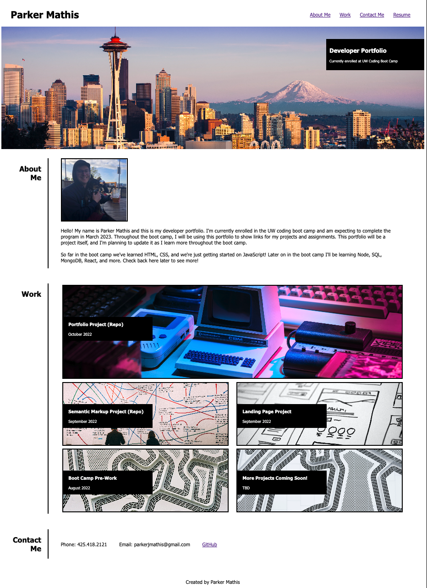

# Portfolio

## Description
The objective of this project was to create a portfolio from scratch. I used the example image in the challenge README to try and follow the layout and functionality as best as I could. 

In the CSS I used flex boxes, media queries, and pseudo elements (for hover effects). 

## Installation

N/A

## Usage

Below are links to the deployed web application and the repository on GitHub.

- https://markerpathis.github.io/portfolio/
- https://github.com/markerpathis/portfolio

Below is a screenshot of the web application:

## Credits

N/A

## License

Please refer to the LICENSE in the repo.